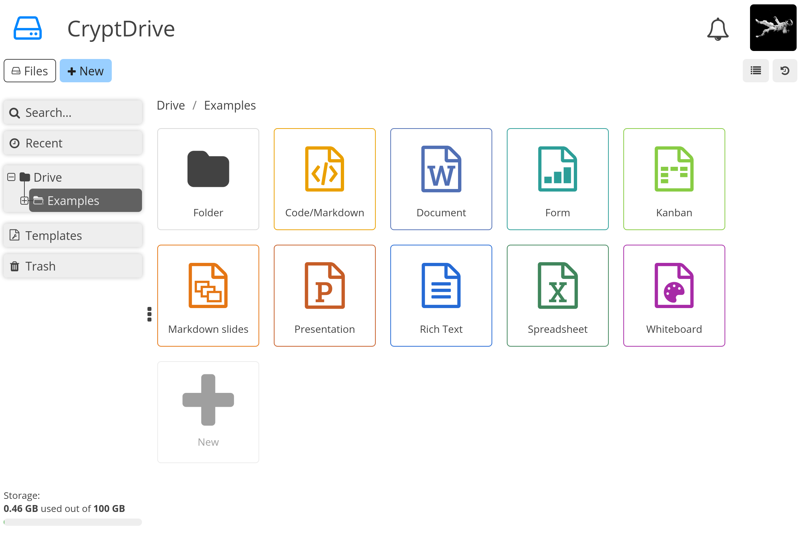

<!--
N.B.: This README was automatically generated by https://github.com/YunoHost/apps/tree/master/tools/README-generator
It shall NOT be edited by hand.
-->

# CryptPad for YunoHost

[](https://dash.yunohost.org/appci/app/cryptpad)    
[](https://install-app.yunohost.org/?app=cryptpad)

*[Lire ce readme en français.](./README_fr.md)*

> *This package allows you to install CryptPad quickly and simply on a YunoHost server.
If you don't have YunoHost, please consult [the guide](https://yunohost.org/#/install) to learn how to install it.*

## Overview

CryptPad is a collaboration suite that is end-to-end-encrypted and open-source. It is built to enable collaboration, synchronizing changes to documents in real time. Because all data is encrypted, the service and its administrators have no way of seeing the content being edited and stored.

**Shipped version:** 4.14.1~ynh1

**Demo:** https://cryptpad.fr/

## Screenshots



## Disclaimers / important information

## Configuration

Once CryptPad is installed, create an account via the Register button on the home page. To make this account an instance administrator:

1. Copy the public key found in User Menu (avatar at the top right) > Settings > Account > Public Signing Key
2. Paste this key in `/var/www/cryptpad/config/config.js` in the following array (uncomment and replace the placeholder):
``` 
adminKeys: [
        "[cryptpad-user1@my.awesome.website/YZgXQxKR0Rcb6r6CmxHPdAGLVludrAF2lEnkbx1vVOo=]",
],
```

3. Restart CryptPad service (In YunoHost webadmin -> Services -> cryptpad -> Restart)

## Documentation and resources

* Official app website: <https://cryptpad.fr/>
* Official admin documentation: <https://docs.cryptpad.fr/en/>
* Upstream app code repository: <https://github.com/xwiki-labs/cryptpad>
* YunoHost documentation for this app: <https://yunohost.org/app_cryptpad>
* Report a bug: <https://github.com/YunoHost-Apps/cryptpad_ynh/issues>

## Developer info

Please send your pull request to the [testing branch](https://github.com/YunoHost-Apps/cryptpad_ynh/tree/testing).

To try the testing branch, please proceed like that.

``` bash
sudo yunohost app install https://github.com/YunoHost-Apps/cryptpad_ynh/tree/testing --debug
or
sudo yunohost app upgrade cryptpad -u https://github.com/YunoHost-Apps/cryptpad_ynh/tree/testing --debug
```

**More info regarding app packaging:** <https://yunohost.org/packaging_apps>
