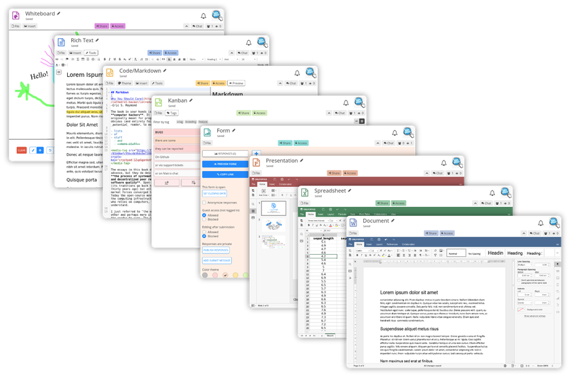

<!--
N.B.: This README was automatically generated by <https://github.com/YunoHost/apps_tools/blob/main/readme_generator>
It shall NOT be edited by hand.
-->

<h1>
  
  CryptPad, packaged for YunoHost
</h1>

Collaborative office suite that is end-to-end encrypted and open-source

[](https://cryptpad.org)
[](https://cryptpad.fr)
[?style=for-the-badge)](https://ci-apps.yunohost.org/ci/apps/cryptpad/)

<div align="center">
<a href="https://apps.yunohost.org/app/cryptpad"></a>
<a href="https://github.com/YunoHost-Apps/cryptpad_ynh/issues"></a>
</div>


## Screenshots



## 📦 Developer info

[](https://ci-apps.yunohost.org/ci/apps/cryptpad/)

🛠️ Upstream CryptPad repository: <https://github.com/cryptpad/cryptpad>

Pull request are welcome and should target the [`testing` branch](https://github.com/YunoHost-Apps/cryptpad_ynh/tree/testing).

The `testing` branch can be tested using:
```
# fresh install:
sudo yunohost app install https://github.com/YunoHost-Apps/cryptpad_ynh/tree/testing

# upgrade an existing install:
sudo yunohost app upgrade cryptpad -u https://github.com/YunoHost-Apps/cryptpad_ynh/tree/testing
```

### 📚 App packaging documentation

Please see <https://doc.yunohost.org/packaging_apps> for more information.