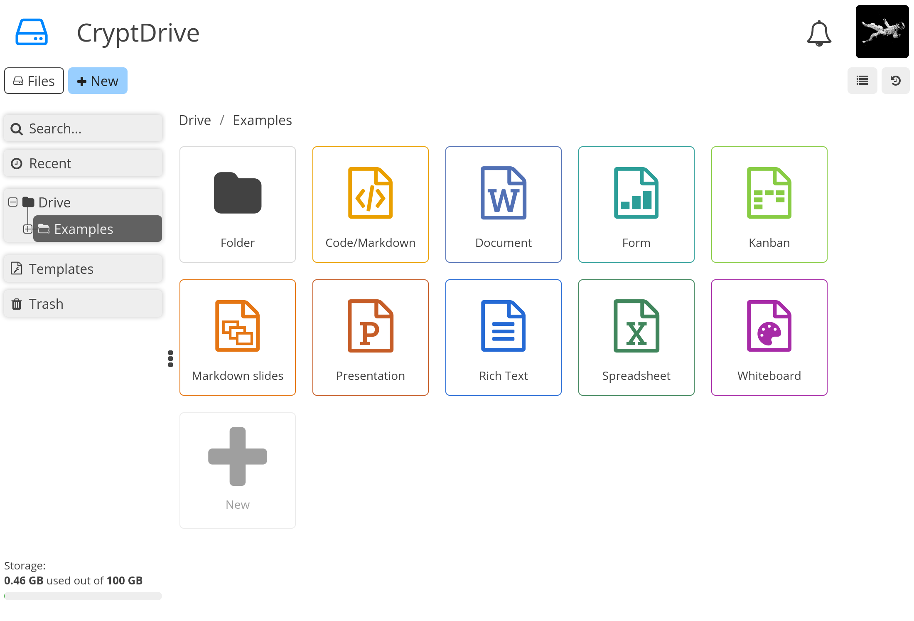

<!--
NOTA: Este README foi creado automáticamente por <https://github.com/YunoHost/apps/tree/master/tools/readme_generator>
NON debe editarse manualmente.
-->

# CryptPad para YunoHost

[](https://ci-apps.yunohost.org/ci/apps/cryptpad/)


[](https://install-app.yunohost.org/?app=cryptpad)

*[Le este README en outros idiomas.](./ALL_README.md)*

> *Este paquete permíteche instalar CryptPad de xeito rápido e doado nun servidor YunoHost.*  
> *Se non usas YunoHost, le a [documentación](https://yunohost.org/install) para saber como instalalo.*

## Vista xeral

CryptPad is a collaboration suite that is end-to-end-encrypted and open-source. It is built to enable collaboration, synchronizing changes to documents in real time. Because all data is encrypted, the service and its administrators have no way of seeing the content being edited and stored.

**Versión proporcionada:** 2024.12.0~ynh4

**Demo:** <https://cryptpad.fr/>

## Capturas de pantalla



## Documentación e recursos

- Web oficial da app: <https://cryptpad.fr/>
- Documentación oficial para admin: <https://docs.cryptpad.fr/en/>
- Repositorio de orixe do código: <https://github.com/cryptpad/cryptpad>
- Tenda YunoHost: <https://apps.yunohost.org/app/cryptpad>
- Informar dun problema: <https://github.com/YunoHost-Apps/cryptpad_ynh/issues>

## Info de desenvolvemento

Envía a túa colaboración á [rama `testing`](https://github.com/YunoHost-Apps/cryptpad_ynh/tree/testing).

Para probar a rama `testing`, procede deste xeito:

```bash
sudo yunohost app install https://github.com/YunoHost-Apps/cryptpad_ynh/tree/testing --debug
ou
sudo yunohost app upgrade cryptpad -u https://github.com/YunoHost-Apps/cryptpad_ynh/tree/testing --debug
```

**Máis info sobre o empaquetado da app:** <https://yunohost.org/packaging_apps>
